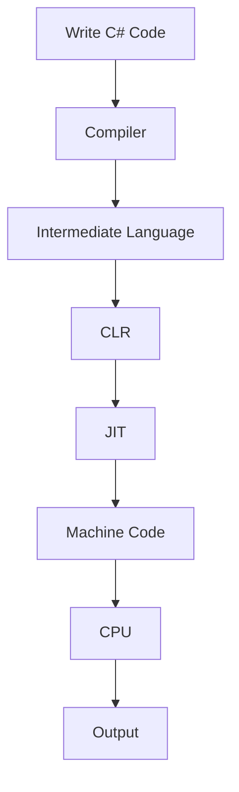

# Program Execution Flow

```mermaid
flowchart TD

A[Write C# Code]
B[Compiler]
C[Intermediate Language]
D[CLR]
E[JIT]
F[Machine Code]
G[CPU]
H[Output]

A --> B --> C --> D --> E --> F --> G --> H
```
