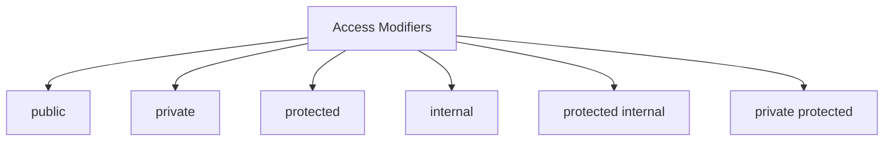

# Access Modifiers



---

## Comparison Table

| Modifier | Same Class | Derived Class | Same Assembly | Outside Assembly |
|-----------|------------|---------------|----------------|------------------|
| public | ✅ | ✅ | ✅ | ✅ |
| private | ✅ | ❌ | ❌ | ❌ |
| protected | ✅ | ✅ | ❌ | ❌ |
| internal | ✅ | ✅ | ✅ | ❌ |
| protected internal | ✅ | ✅ | ✅ | ✅ (Derived Only) |
| private protected | ✅ | ✅ (Same Assembly) | ✅ | ❌ |

---

## Visual

```
                 Entire Application

+-------------------------------------------+

      public

+------------------------------+

     internal

+------------------+

 protected

+---------+

 private

+---------+
```

---

## Example

```csharp
public void Show()
{
}

private void Hide()
{
}

protected void Calculate()
{
}
```

---

## Best Practice

| Modifier | Use For |
|------------|----------|
| public | API Methods |
| private | Helper Methods |
| protected | Base Classes |
| internal | Internal Library |