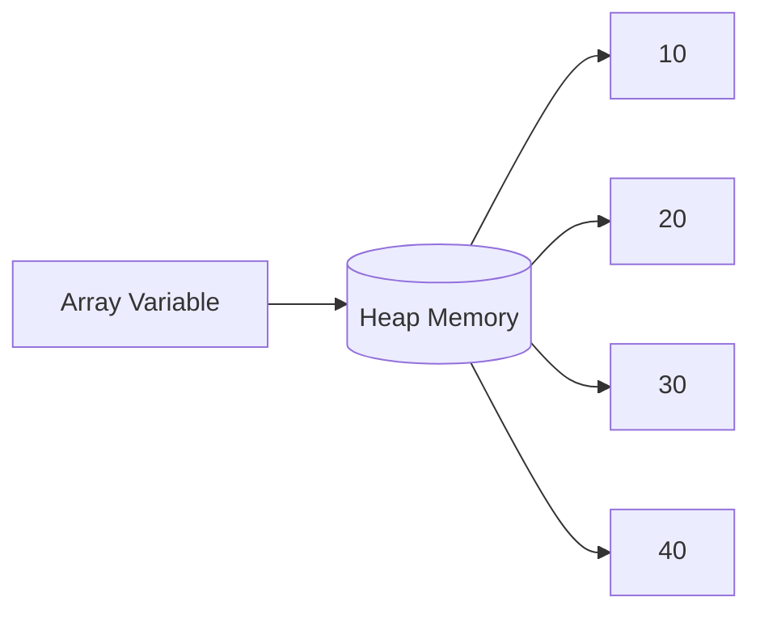

# Array Memory Diagram

```text
Stack

numbers
   │
   ▼

Heap

Index

0     1     2     3

+-----+-----+-----+-----+

| 10 | 20 | 30 | 40 |

+-----+-----+-----+-----+
```

---

## Mermaid Diagram

