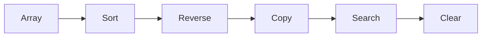

# Common Array Methods

| Method | Description |
|---------|-------------|
| Array.Sort() | Sort elements |
| Array.Reverse() | Reverse order |
| Array.Clear() | Reset values |
| Array.Copy() | Copy array |
| Array.IndexOf() | Find element index |
| Array.BinarySearch() | Binary search |

---

## Method Flow

