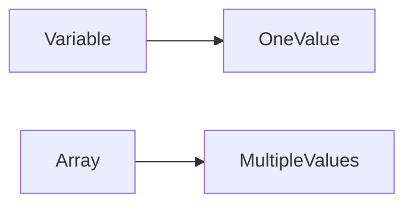

# Variable vs Array

| Variable | Array |
|----------|-------|
| Stores one value | Stores multiple values |
| Separate variable for each value | One variable with indexes |
| Difficult to manage many values | Easy to manage many values |

---

## Diagram

