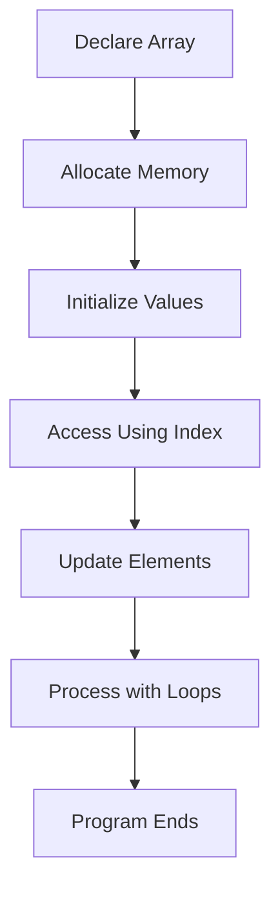

# How Arrays Work

```mermaid
flowchart TD

A[Declare Array]

-->

B[Allocate Memory]

-->

C[Initialize Values]

-->

D[Access Using Index]

-->

E[Update Elements]

-->

F[Process with Loops]

-->

G[Program Ends]
```

---

Arrays store values in **contiguous memory**, allowing fast access by index.