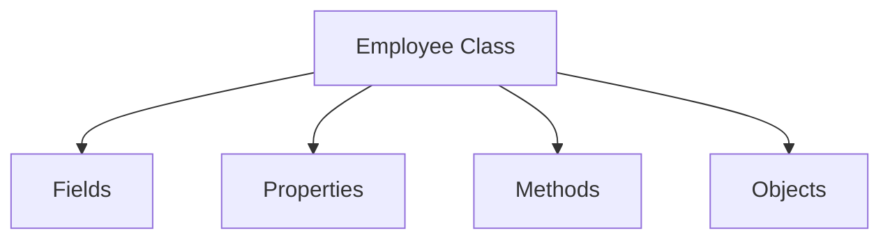

# Class Members

## Diagram

```text
Class
├── Fields
├── Properties
├── Methods
└── Objects
```

---

## Mermaid Diagram



---

## Explanation

- **Fields** — plain variables declared inside the class that store raw data (see `Fields.cs`).
- **Properties** — controlled access points to data, using `get`/`set` (see `Properties.cs`).
- **Methods** — actions the class can perform, such as `FindSalary()` (see `Methods.cs`).
- **Objects** — are not a member declared inside the class; they are the instances created from it using `new` (see `object-lifecycle.md`).

```csharp
class Employee
{
    public int EmployeeID { get; set; } // Property
    public double Salary { get; set; }  // Property

    public double FindSalary()          // Method
    {
        return Salary * 1.10;
    }
}
```

See: `Notes/12-Class-and-Object.md`, `Code/Classes/ClassAndObject/Employee.cs`
