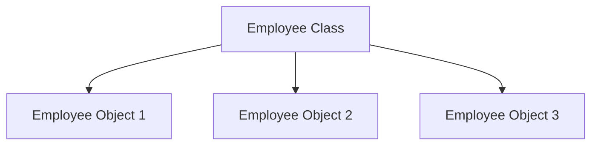

# Class vs Object

## Diagram

```text
Class
  ↓
Blueprint
  ↓
Object
```

---

## Mermaid Diagram



---

## Explanation

`Employee` is the class — a single blueprint with no real data of its own.

Each arrow represents one `new Employee()` call, producing an independent object with its own values for `EmployeeID`, `Name`, `Age`, and `Salary`.

```csharp
Employee emp1 = new Employee();
Employee emp2 = new Employee();
Employee emp3 = new Employee();
```

One class can be used to create as many objects as needed, and changing one object never affects the others.

See: `Notes/12-Class-and-Object.md`, `Code/Classes/ClassAndObject/Employee.cs`
