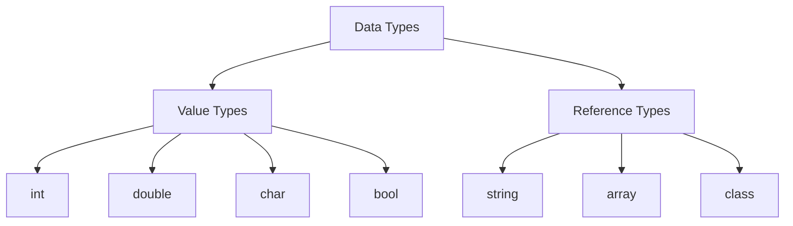

# Data Types Diagram

## Classification

```text
Data Types
│
├── Value Types
│   ├── byte
│   ├── short
│   ├── int
│   ├── long
│   ├── float
│   ├── double
│   ├── decimal
│   ├── char
│   └── bool
│
└── Reference Types
    ├── string
    ├── object
    ├── array
    ├── class
    └── interface
```

## Mermaid Diagram


