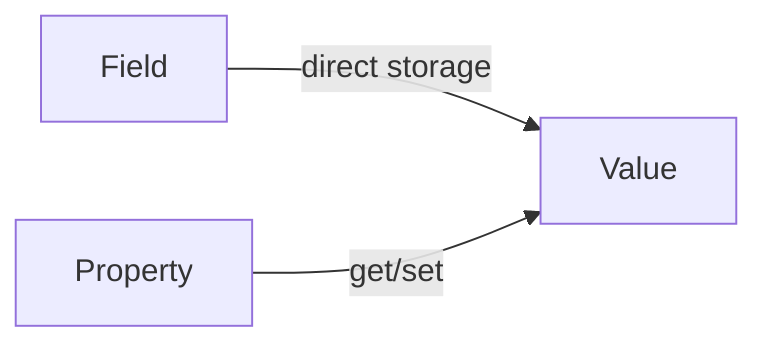

# Field vs Property

## Comparison

| Aspect | Field | Property |
| --- | --- | --- |
| Definition | Plain variable declared inside a class | Controlled access point to a value, using `get`/`set` |
| Syntax | `public int Age;` | `public int Age { get; set; }` |
| Purpose | Raw data storage | Safely expose/validate data |
| Access | Direct, no logic runs | Goes through `get` (read) / `set` (write) |
| Example | `public string Name;` | `public string Name { get; set; }` |
| Beginner usage | Quick demos, understanding storage | Everyday class design (recommended default) |

---

## Diagram



---

## Employee Example

```csharp
// Field (raw storage)
private double salary;

// Property (controlled access to the field above)
public double Salary
{
    get { return salary; }
    set { salary = value; }
}
```

In short: **fields store data, properties control how that data is read or changed.**

See: `Notes/12-Class-and-Object.md`, `Code/Classes/ClassAndObject/Fields.cs`, `Code/Classes/ClassAndObject/Properties.cs`
