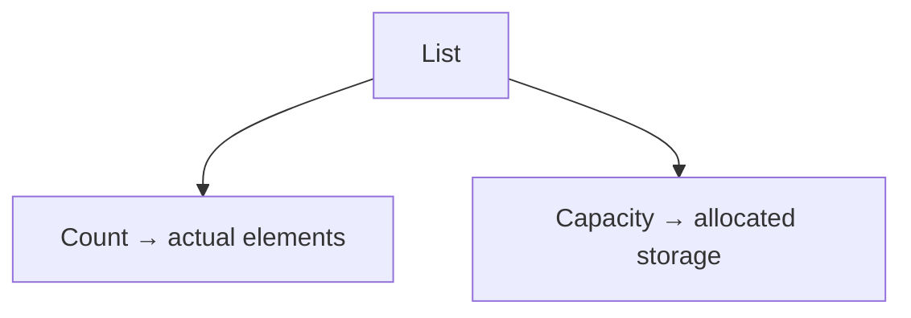

# List\<T\>: Count vs Capacity

## Diagram

```text
List<T>
├── Count
└── Capacity
```

---

## Mermaid Diagram



---

## Count

The number of actual elements **currently stored** in the list. Updates automatically every time an item is added or removed.

## Capacity

The amount of internal storage **currently allocated** for elements. `List<T>` may allocate more room than is immediately needed, to avoid resizing on every single `Add()`.

```text
Count ≤ Capacity
```

`Capacity`:

- Is **not** a hard maximum on how many items the list can ever hold.
- Can be greater than `Count`.
- Grows automatically whenever more room is needed than is currently allocated.
- Has implementation-dependent exact values (can vary by .NET version) — do not rely on a specific number.

---

## Example

```csharp
List<int> numbers = new List<int>();

numbers.Add(10);
numbers.Add(20);
numbers.Add(30);
```

Conceptually:

```text
Count    → 3
Capacity → 3 or greater
```

The exact `Capacity` value after these calls is an internal detail and is not guaranteed to be any specific number — only that it will be at least `3`.

---

## Common Mistake

> Capacity is NOT the maximum number of elements a List can contain.

`Capacity` only reflects the currently allocated internal storage. When more items are added than the current `Capacity` allows, `List<T>` automatically grows it — there is no fixed upper limit imposed by `Capacity` itself.

See: `Notes/13-Using-List-Class.md`, `Code/Classes/ListClass/CountAndCapacity.cs`
