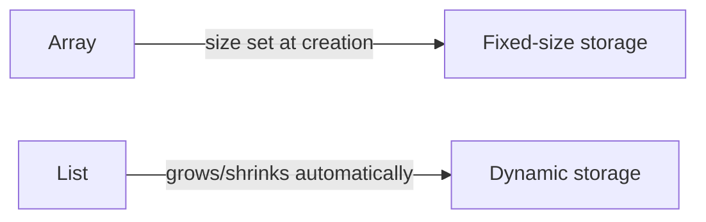

# Array vs List\<T\>

## Diagram

```text
Array
  ↓
Fixed-size collection

List<T>
  ↓
Dynamic collection
```

---

## Mermaid Diagram



---

## Comparison

| Aspect | Array | List\<T\> |
| --- | --- | --- |
| Size | Fixed once created | Resizable — grows/shrinks automatically |
| Declaration | `int[] numbers;` | `List<int> numbers;` |
| Initialization | `int[] numbers = new int[3];` | `List<int> numbers = new List<int>();` |
| Adding elements | No `Add()` — must assign by index within the fixed size | `numbers.Add(10);` |
| Removing elements | No `Remove()` — can only overwrite a slot's value | `numbers.Remove(10);` / `numbers.RemoveAt(0);` |
| Accessing elements | `numbers[0]` | `numbers[0]` |
| Updating elements | `numbers[0] = 99;` | `numbers[0] = 99;` |
| Size property | `Length` | `Count` |
| Flexibility | Low — size is locked in after creation | High — size adjusts as items are added/removed |
| Typical beginner use | A known, unchanging number of items | A collection whose size may change while the program runs |

---

## Examples

```csharp
int[] numbers = new int[3];
numbers[0] = 10;
```

```csharp
List<int> numbers = new List<int>();
numbers.Add(10);
```

Both support index-based access (`numbers[0]`), and both start counting from index `0`.

---

## Important Note

Arrays are **not** unchangeable — individual elements can still be updated after creation (`numbers[0] = 99;`). What is fixed is the **size**: once an array is created with a given length, that length cannot grow or shrink. A `List<T>` removes this restriction by automatically resizing its internal storage as items are added or removed.

See: `Notes/13-Using-List-Class.md`, `Code/Classes/ListClass/ListOfIntegers.cs`
