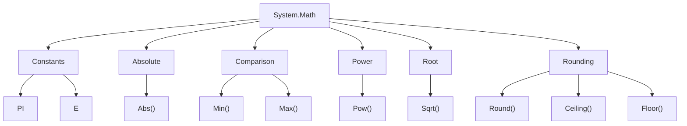

# Math Class - Method Chart

## Diagram

```text
System.Math
│
├── Constants
│   ├── PI
│   └── E
│
├── Absolute
│   └── Abs()
│
├── Comparison
│   ├── Min()
│   └── Max()
│
├── Power
│   └── Pow()
│
├── Root
│   └── Sqrt()
│
└── Rounding
    ├── Round()
    ├── Ceiling()
    └── Floor()
```

---

## Mermaid Diagram



---

## Member Reference

| Member | Purpose | Example | Result / Type |
| --- | --- | --- | --- |
| `Math.PI` | Constant: ratio of circumference to diameter | `Math.PI` | `3.14159...` (`double`) |
| `Math.E` | Constant: base of natural logarithms | `Math.E` | `2.71828...` (`double`) |
| `Math.Abs(x)` | Absolute (non-negative) value | `Math.Abs(-10)` | `10` |
| `Math.Min(a, b)` | The smaller of two values | `Math.Min(10, 20)` | `10` |
| `Math.Max(a, b)` | The larger of two values | `Math.Max(10, 20)` | `20` |
| `Math.Pow(base, exp)` | Raises `base` to the power of `exp` | `Math.Pow(2, 3)` | `8` (`double`) |
| `Math.Sqrt(x)` | Square root | `Math.Sqrt(25)` | `5` (`double`) |
| `Math.Round(x)` | Nearest whole number | `Math.Round(10.6)` | `11` |
| `Math.Ceiling(x)` | Rounds toward positive infinity (up) | `Math.Ceiling(10.2)` | `11` |
| `Math.Floor(x)` | Rounds toward negative infinity (down) | `Math.Floor(10.8)` | `10` |

---

## `Round()` vs `Ceiling()` vs `Floor()`

```text
Round()    → nearest whole number
Ceiling()  → always toward positive infinity (up)
Floor()    → always toward negative infinity (down)
```

> **Note:** Default `Math.Round(value)` uses **midpoint rounding to even** (banker's rounding) — `Math.Round(10.5)` is `10`, not `11`.

`Ceiling()`/`Floor()` are not just "add 1" or "drop the decimal" — for negative numbers, `Math.Ceiling(-10.2)` is `-10` and `Math.Floor(-10.8)` is `-11`.

---

## Important

```text
Math.Pow()  → returns double, never int
Math.Sqrt() → returns double, never int
Math math = new Math(); → NOT valid, Math is a static class
```

See: `Notes/16-Using-Math-Class.md`, `Code/Classes/MathClass/`
