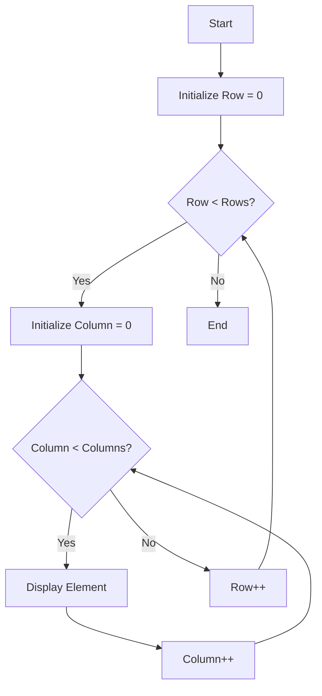

# Matrix Traversal Flowchart

```mermaid
flowchart TD

A[Start]

-->

B[Initialize Row = 0]

-->

C{Row < Rows?}

C -->|Yes| D[Initialize Column = 0]

D --> E{Column < Columns?}

E -->|Yes| F[Display Element]

F --> G[Column++]

G --> E

E -->|No| H[Row++]

H --> C

C -->|No| I[End]
```