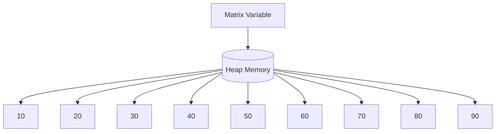

# Matrix Memory Diagram

```text
Stack

matrix
   │
   ▼

Heap

      Column

      0     1     2

    +-----+-----+-----+

0   | 10 | 20 | 30 |

    +-----+-----+-----+

1   | 40 | 50 | 60 |

    +-----+-----+-----+

2   | 70 | 80 | 90 |

    +-----+-----+-----+
```

