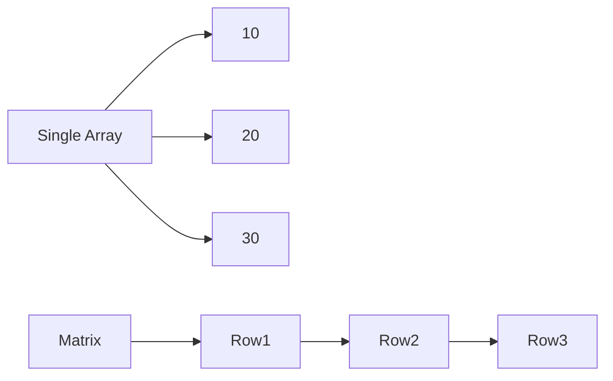

# Single Array vs Multidimensional Array

| Single Array | Multidimensional Array |
|--------------|------------------------|
| One Dimension | Two or More Dimensions |
| Index: `[i]` | Index: `[row,column]` |
| Linear Data | Tabular Data |
| One Loop | Nested Loops |

---

## Diagram



---

## Example

### Single Array

```csharp
int[] numbers = {10,20,30};
```

### Multidimensional Array

```csharp
int[,] numbers =
{
    {10,20},
    {30,40}
};
```