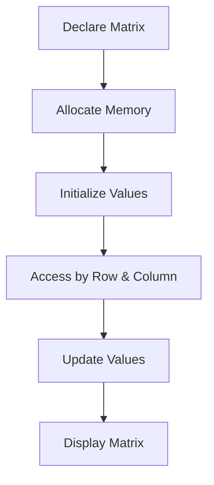

# Matrix Working


```mermaid
flowchart TD

A[Declare Matrix]

-->

B[Allocate Memory]

-->

C[Initialize Values]

-->

D[Access by Row & Column]

-->

E[Update Values]

-->

F[Display Matrix]
```

---

A multidimensional array stores elements in a rectangular format. Every element is accessed using two indexes:

```
[row,column]
```