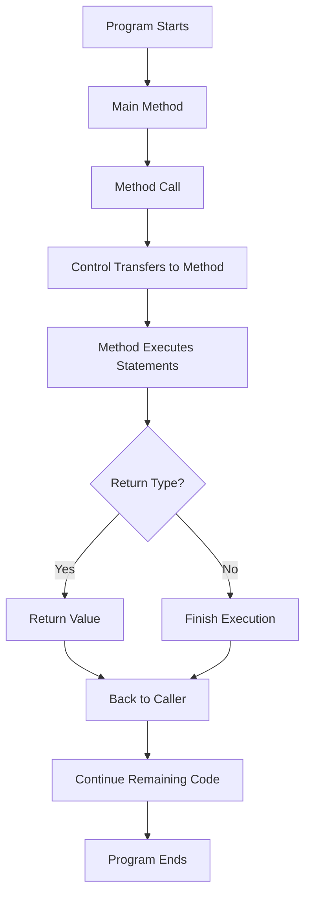

# Method Execution Flow

## Flowchart



---

## Example

```csharp
static void Main()
{
    int result = Add(10, 20);

    Console.WriteLine(result);
}

static int Add(int a, int b)
{
    return a + b;
}
```

Execution Flow

```
Main()

↓

Add(10,20)

↓

30 Returned

↓

Console.WriteLine()

↓

Program Ends
```