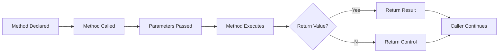

# Method Life Cycle



---

## Method Life Cycle

```
Declare Method

↓

Compile Program

↓

Call Method

↓

Pass Parameters

↓

Execute Statements

↓

Return Value (Optional)

↓

Back to Caller
```

---

## Important

A method **does not execute** until it is called.