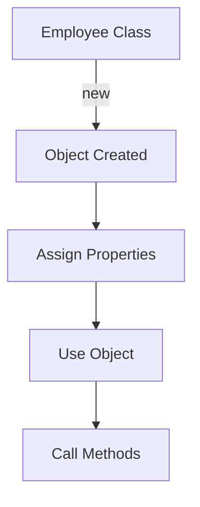

# Object Lifecycle

## Diagram

```text
Class
  ↓
new
  ↓
Object Created
  ↓
Assign Properties
  ↓
Use Object
  ↓
Call Methods
```

---

## Mermaid Diagram



---

## Example

```csharp
Employee employee = new Employee();

employee.EmployeeID = 201;
employee.Name = "Priya";
employee.Salary = 50000;

double finalSalary = employee.FindSalary();
```

---

## Explanation

1. `Employee` is the class (blueprint) — no object exists yet.
2. `new Employee()` creates a real object in memory.
3. The properties (`EmployeeID`, `Name`, `Salary`) are assigned real values.
4. The object is used — its property values are read.
5. A method (`FindSalary()`) is called, using the object's own data.

This is a conceptual lifecycle for beginners; it does not cover garbage collection or memory management.

See: `Notes/12-Class-and-Object.md`, `Code/Classes/ClassAndObject/Program.cs`
