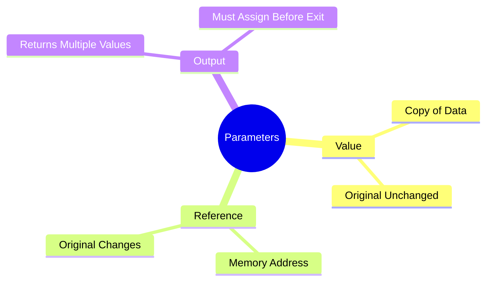

# Parameter Types



---

## Comparison

| Type | Keyword | Copy or Reference | Original Changes? |
|-------|----------|-------------------|-------------------|
| Value | None | Copy | ❌ No |
| Reference | ref | Reference | ✅ Yes |
| Output | out | Reference | ✅ Yes |

---

## Value Parameter

```csharp
void Increment(int number)
```

```
number

↓

Copy

↓

Method
```

---

## Reference Parameter

```csharp
void Increment(ref int number)
```

```
Original Variable

↓

Memory Address

↓

Method
```

---

## Output Parameter

```csharp
void GetData(out int age)
```

```
Method

↓

Assign Value

↓

Return to Caller
```