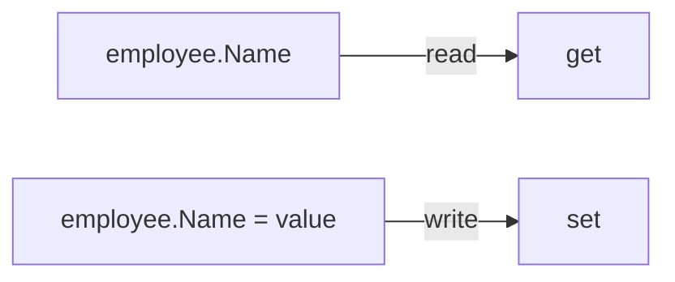

# Property: get and set

## Diagram

```text
Property
   │
   ├── get → read value
   │
   └── set → assign/change value
```

---

## Mermaid Diagram



---

## Example

```csharp
public string Name { get; set; }
```

---

## Explanation

- **`get`** returns the current value of the property. It runs whenever the property is read.
- **`set`** assigns a new value to the property. It runs whenever the property is written to, and receives the incoming value through the implicit keyword `value`.

```csharp
employee.Name = "John";            // set runs, value = "John"
Console.WriteLine(employee.Name);  // get runs, returns "John"
```

`get` executes on read, `set` executes on write — they never run at the same time.

See: `Notes/12-Class-and-Object.md`, `Code/Classes/ClassAndObject/GetSet.cs`
