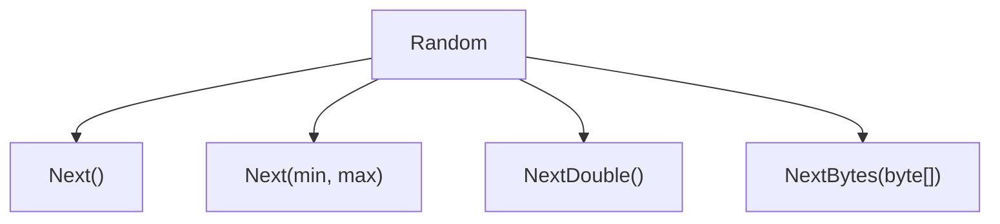

# Random Class - Method Chart

## Diagram

```text
Random
│
├── Next()
├── Next(min, max)
├── NextDouble()
└── NextBytes(byte[])
```

---

## Mermaid Diagram



---

## Method Reference

| Method | Returns | Purpose | Range / Behavior |
| --- | --- | --- | --- |
| `Next()` | `int` | Any general-purpose random integer | Non-negative integer (no fixed upper bound) |
| `Next(min, max)` | `int` | A random integer within a specific range | `min` inclusive, `max` **exclusive** |
| `NextDouble()` | `double` | A random fractional value | `0.0` inclusive, `1.0` **exclusive** |
| `NextBytes(byte[])` | `void` | Fills an existing byte array with random values | Fills the supplied array in place; does **not** return a new array |

---

## Examples

```csharp
Random random = new Random();

int number = random.Next();          // non-negative integer

int ranged = random.Next(1, 10);      // 1 through 9, never 10

double value = random.NextDouble();   // 0.0 <= value < 1.0

byte[] bytes = new byte[5];
random.NextBytes(bytes);              // fills "bytes" in place
```

---

## Key Rules

```text
Next()
→ non-negative integer

Next(min, max)
→ min inclusive
→ max exclusive

NextDouble()
→ 0.0 inclusive
→ 1.0 exclusive

NextBytes(byte[])
→ fills the supplied byte array
→ returns void
```

See: `Notes/14-Using-Random-Class.md`, `Code/Classes/RandomClass/RandomNumbers.cs`, `RandomRange.cs`, `RandomDouble.cs`, `RandomBytes.cs`
