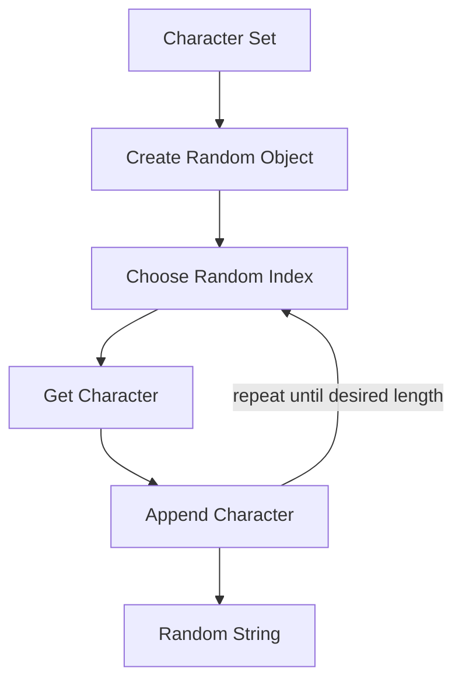

# Random String / Password Flow

> ⚠️ **LEARNING EXAMPLE ONLY**

## Diagram

```text
Character Set
      ↓
Create Random Object
      ↓
Choose Random Index
      ↓
Get Character
      ↓
Append Character
      ↓
Repeat Until Desired Length
      ↓
Random String
```

---

## Mermaid Diagram



---

## Example

```csharp
string characters = "ABCDEFGHIJKLMNOPQRSTUVWXYZabcdefghijklmnopqrstuvwxyz0123456789";

int index = random.Next(0, characters.Length);
char character = characters[index];
```

---

## Why `0` and `characters.Length`?

- `0` is **inclusive** — the first character in the string (`characters[0]`) is a valid, reachable index.
- `characters.Length` is **exclusive** — it is one past the last valid index, so it keeps the generated index within the string's actual bounds (`0` to `characters.Length - 1`), never causing an out-of-range error.

Repeating this selection in a loop and appending each character builds up the final random string/password.

---

## ⚠️ Security Warning

This technique is a **learning example only**, meant to practice `Random` and string building.

- `System.Random` is **not** appropriate for security-sensitive password or token generation.
- Real authentication/security systems should use a proper cryptographic API, such as `System.Security.Cryptography`.
- Cryptographic password generation is **not** implemented here — it is outside the scope of this lecture.

See: `Notes/14-Using-Random-Class.md`, `Code/Classes/RandomClass/RandomPassword.cs`
