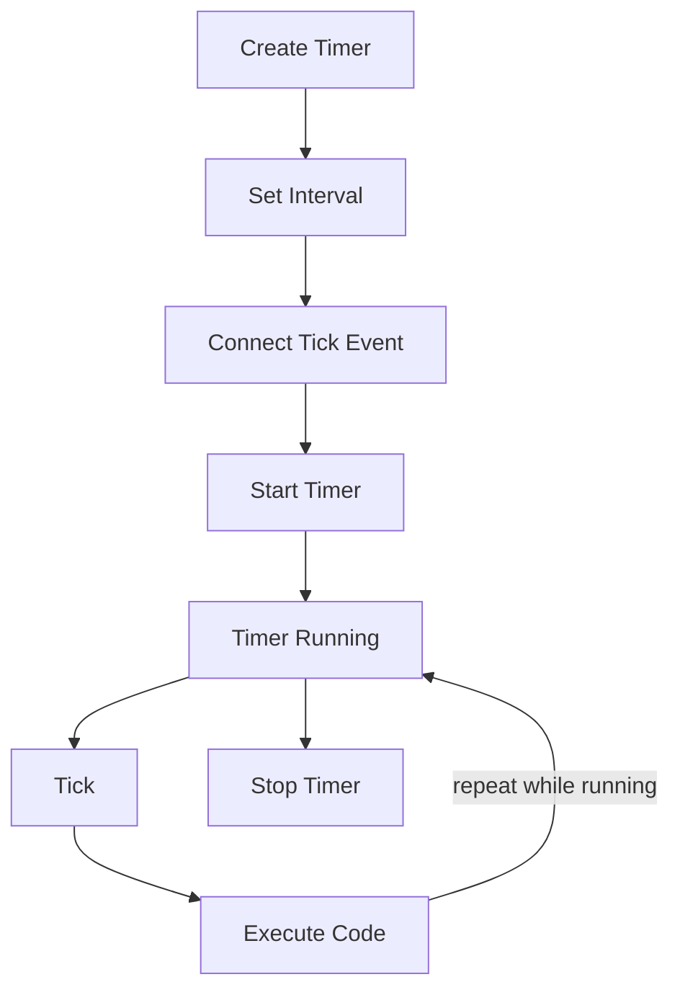

# Timer Lifecycle

## Diagram

```text
Create Timer
     ↓
Set Interval
     ↓
Connect Tick Event
     ↓
Start Timer
     ↓
Timer Running
     ↓
Tick
     ↓
Execute Code
     ↓
Repeat
     ↓
Stop Timer
```

---

## Mermaid Diagram



---

## Explanation

1. **Create Timer** — `Timer timer = new Timer();`
2. **Set Interval** — `timer.Interval = 1000;` (milliseconds)
3. **Connect Tick Event** — `timer.Tick += timer_Tick;`
4. **Start Timer** — `timer.Start();` begins the cycle
5. **Timer Running → Tick → Execute Code** — repeats once per `Interval` for as long as the Timer is running
6. **Stop Timer** — `timer.Stop();` ends the cycle; `Start()` can be called again later to resume it

A Timer is not single-use — it can move between "Running" and "Stopped" repeatedly during a form's lifetime.

See: `Notes/15-Using-Timer-Class.md`, `Code/Classes/TimerClass/Form1.cs`
