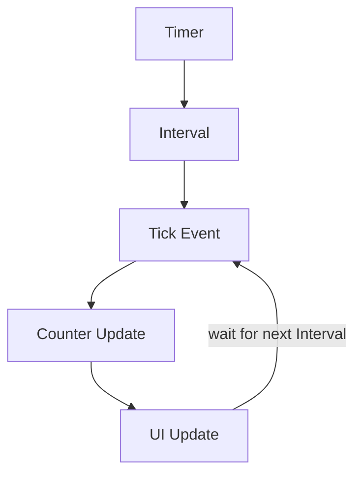

# Timer Tick Flow (Counter Example)

## Diagram

```text
Timer
 ↓
Interval
 ↓
Tick Event
 ↓
Counter Update
 ↓
UI Update
 ↓
Next Tick
```

---

## Mermaid Diagram



---

## Example

```csharp
private int counter = 0;

private void timer_Tick(object sender, EventArgs e)
{
    counter++;
    label1.Text = counter.ToString();
}
```

---

## Explanation

- `counter` is declared **outside** the `Tick` handler (as a class-level field), so its value is preserved between ticks.
- On every `Tick`, `counter++` increases the stored value by exactly 1.
- `label1.Text = counter.ToString();` immediately reflects the new value on the form.
- This repeats automatically, once per `Interval`, for as long as the Timer is running — no threads, async code, or manual scheduling involved.

See: `Notes/15-Using-Timer-Class.md`, `Code/Classes/TimerClass/TimerCounter.cs`, `Code/Classes/TimerClass/Form1.cs`
