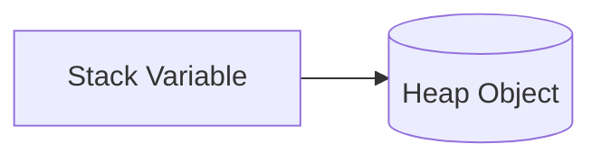

# Value Types vs Reference Types

## Value Type

```text
Stack

age = 23
```

Each variable stores its own copy.

---

## Reference Type

```text
Stack

person ----+

Heap
+------------------+
| Name = Gayatri   |
+------------------+
```

The variable stores the address of the object, not the object itself.

---

## Mermaid Diagram


