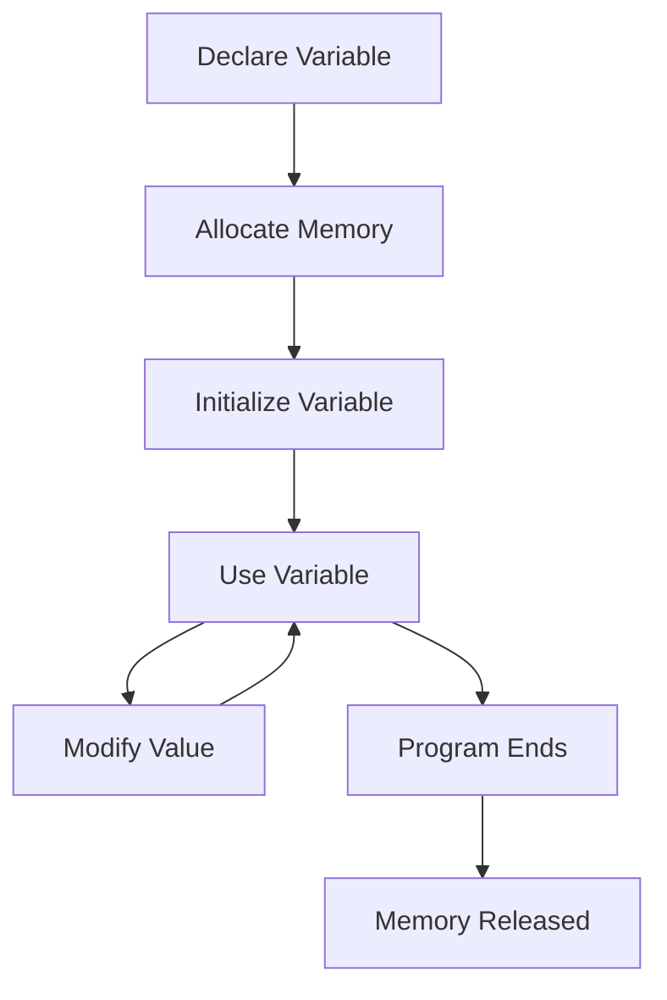

# Variable Life Cycle

## Flow

---

## Steps

1. Declare the variable.
2. Memory is allocated.
3. Initial value is assigned.
4. Variable is used in the program.
5. Value may change.
6. Program terminates.
7. Memory is released.
