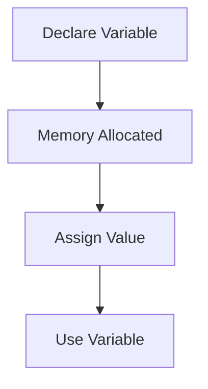

# Variable Memory Diagram

## Memory Representation

```text
RAM

+------------------------+
| Variable | Value       |
|----------|-------------|
| age      | 23          |
| salary   | 50000.50    |
| name     | Gayatri     |
| active   | True        |
+------------------------+
```

## Mermaid Diagram


