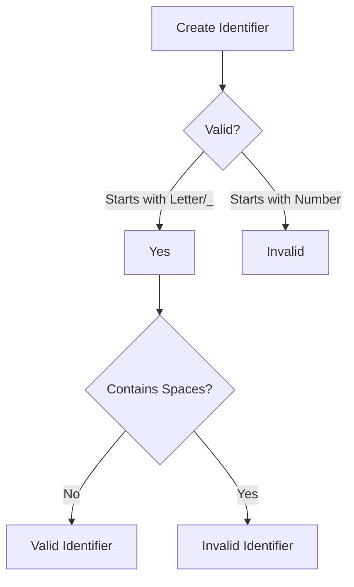

# Naming Rules in C#

> **Module:** 02 - C# Fundamentals  
> **Topic:** Naming Rules  
> **Difficulty:** 🟢 Beginner  
> **Prerequisites:** Variables, Data Types

---

# Overview

Naming variables, methods, classes, and other identifiers correctly is an important part of writing clean and maintainable code.

Good naming conventions make code easier to read, understand, debug, and maintain.

Poor naming makes code confusing even if it works correctly.

---

# Definition

Naming Rules are the rules defined by the C# language for creating valid identifiers.

Naming Conventions are the recommended practices followed by developers to make code readable.

---

# Why do we need Naming Rules?

Imagine reading this code:

```csharp
int x = 20;
int y = 30;
int z = x + y;
```

Now compare it with:

```csharp
int firstNumber = 20;
int secondNumber = 30;
int totalMarks = firstNumber + secondNumber;
```

The second example is much easier to understand.

Good naming:

- Improves readability
- Makes debugging easier
- Makes teamwork easier
- Makes projects maintainable
- Reduces mistakes

---

# Identifier

An **Identifier** is the name given to:

- Variable
- Method
- Class
- Interface
- Namespace
- Property

Example

```csharp
int studentAge = 22;
```

Here,

```
studentAge
```

is an Identifier.

---

# Naming Rules

## Rule 1

Must start with

- Letter
- Underscore (\_)

✔ Correct

```csharp
studentName

_total

salary2025
```

❌ Incorrect

```csharp
123salary
```

---

## Rule 2

Cannot contain spaces

❌

```csharp
student age
```

✔

```csharp
studentAge
```

---

## Rule 3

Cannot use C# Keywords

❌

```csharp
int class = 10;
```

✔

```csharp
int classNumber = 10;
```

---

## Rule 4

Can contain numbers

✔

```csharp
student1

version2
```

---

## Rule 5

Special characters are not allowed

❌

```csharp
student-name

salary$

emp#
```

---

## Rule 6

Identifiers are Case Sensitive

```csharp
int age = 20;

int Age = 30;
```

These are two different variables.

---

# Naming Conventions

Although these are not language rules, professional developers follow them.

## Variables

Use **camelCase**

```csharp
studentName

totalMarks

employeeSalary
```

---

## Methods

Use **PascalCase**

```csharp
CalculateSalary()

DisplayStudent()
```

---

## Classes

Use **PascalCase**

```csharp
Student

Employee

BankAccount
```

---

## Interfaces

Start with **I**

```csharp
IRepository

ILogger

IEmployeeService
```

---

## Constants

Use **PascalCase**

```csharp
MaxStudents

Pi

DefaultTimeout
```

---

# Good vs Bad Naming

| Bad | Good         |
| --- | ------------ |
| a   | age          |
| x   | totalMarks   |
| s   | studentName  |
| d   | joiningDate  |
| p   | productPrice |

---

# Flow Diagram



---

# Memory Representation

```text
RAM

+---------------------------+
| studentName | Gayatri     |
| age         | 23          |
| salary      | 45000.50    |
+---------------------------+
```

---

# Code Example

```csharp
using System;

class Student
{
    static void Main()
    {
        string studentName = "Gayatri";
        int studentAge = 23;
        double studentMarks = 92.50;

        Console.WriteLine(studentName);
        Console.WriteLine(studentAge);
        Console.WriteLine(studentMarks);
    }
}
```

---

# Output

```
Gayatri
23
92.5
```

---

# Real World Example

Hospital Management System

```csharp
string patientName;

int patientAge;

string bloodGroup;

decimal consultationFee;
```

Good names explain the purpose without comments.

---

# Best Practices

✔ Use meaningful names.

✔ Follow camelCase for variables.

✔ Follow PascalCase for classes and methods.

✔ Keep names short but descriptive.

✔ Avoid abbreviations unless they are commonly understood.

Example

```csharp
employeeSalary
```

instead of

```csharp
es
```

---

# Common Mistakes

❌

```csharp
int x;
```

✔

```csharp
int totalMarks;
```

---

❌

```csharp
int student age;
```

✔

```csharp
int studentAge;
```

---

❌

```csharp
int class;
```

✔

```csharp
int classNumber;
```

---

# Interview Questions

### What is an Identifier?

An identifier is the name used to identify variables, methods, classes, properties, interfaces, and other program elements.

---

### What is camelCase?

The first word starts with a lowercase letter, and each subsequent word starts with an uppercase letter.

Example

```csharp
studentName
```

---

### What is PascalCase?

Every word starts with an uppercase letter.

Example

```csharp
StudentDetails
```

---

### Can an identifier start with a number?

No.

---

### Are C# identifiers case-sensitive?

Yes.

---

# Quick Revision

## Valid Identifier

```csharp
studentName
```

## Invalid Identifier

```csharp
123student
```

## Variable Naming

camelCase

## Class Naming

PascalCase

## Interface Naming

Starts with I

---

# Practice Exercises

### Exercise 1

Create variables using meaningful names for:

- Student
- Employee
- Product

---

### Exercise 2

Correct the following names:

```text
student age

1salary

class
```

---

### Exercise 3

Create a class named **EmployeeManagement**.

Inside it, declare:

- employeeName
- employeeId
- employeeSalary

---

# Summary

Naming rules ensure identifiers are valid according to the C# language, while naming conventions improve readability and maintainability.

Using meaningful names and following camelCase and PascalCase conventions makes your code easier to understand, debug, and maintain.

---

# References

- Microsoft Learn – C# Coding Conventions
- C# Programming Guide
- .NET Runtime Style Guide
