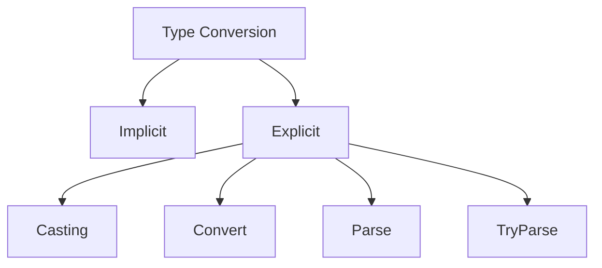

# 🔄 04 - Type Conversion in C#

> Module: 02 - C# Fundamentals

---

# 📚 What is Type Conversion?

Type Conversion means converting one data type into another.

Example:

```
int → double

double → int

string → int

char → int
```

---

# Why is Type Conversion Needed?

Suppose:

```csharp
int age = 23;
double salary = 45000.50;
```

Sometimes we need

- Store integer into decimal
- Convert decimal into integer
- Read string input and convert into number

Without conversion C# gives compile errors.

---

# Type Conversion Types

```
               Type Conversion
                     │
         ┌───────────┴────────────┐
         │                        │
Implicit Conversion        Explicit Conversion
(Automatic)                  (Manual)

```

---

# 1️⃣ Implicit Conversion (Automatic)

Smaller datatype is automatically converted into larger datatype.

```
byte

↓

short

↓

int

↓

long

↓

float

↓

double

↓

decimal
```

Example

```csharp
int number = 10;

double value = number;

Console.WriteLine(value);
```

Output

```
10
```

No data loss.

---

# Example

```csharp
char letter = 'A';

int ascii = letter;

Console.WriteLine(ascii);
```

Output

```
65
```

---

# 2️⃣ Explicit Conversion (Casting)

Larger datatype converted into smaller datatype.

Programmer must tell C# to convert.

Syntax

```csharp
(TargetType)Variable
```

Example

```csharp
double salary = 12500.75;

int amount = (int)salary;

Console.WriteLine(amount);
```

Output

```
12500
```

Notice

```
12500.75

↓

12500
```

Decimal part removed.

---

# Data Loss

```
double

↓

int

↓

Decimal Lost
```

Example

```csharp
double pi = 3.14;

int value = (int)pi;

Console.WriteLine(value);
```

Output

```
3
```

---

# Convert Class

Instead of casting we can use Convert class.

Example

```csharp
double price = 45.89;

int number = Convert.ToInt32(price);

Console.WriteLine(number);
```

Output

```
46
```

Notice

Convert rounds the value.

---

# Difference

Casting

```
45.89

↓

45
```

Convert

```
45.89

↓

46
```

---

# Parse Method

Used for converting string into datatype.

Example

```csharp
string age = "23";

int number = int.Parse(age);

Console.WriteLine(number);
```

Output

```
23
```

---

# Parse Example

```csharp
string salary = "45000";

double money = double.Parse(salary);

Console.WriteLine(money);
```

---

# TryParse

Safest conversion method.

Does not throw exception.

Syntax

```csharp
int.TryParse()
```

Example

```csharp
string input = "25";

bool result = int.TryParse(input, out int age);

Console.WriteLine(result);

Console.WriteLine(age);
```

Output

```
True

25
```

---

# Invalid Input Example

```csharp
string input = "ABC";

bool result = int.TryParse(input, out int age);

Console.WriteLine(result);
```

Output

```
False
```

No exception.

---

# Parse vs TryParse

| Parse | TryParse |
|--------|-----------|
| Throws Exception | No Exception |
| Less Safe | Safer |
| Faster | Slightly Slower |
| Use when input is trusted | Use for user input |

---

# Convert vs Parse

| Convert | Parse |
|----------|--------|
| Converts many types | Converts strings |
| Handles null | Null causes exception |
| Uses Convert class | Uses datatype |

---

# Boxing

Converting Value Type into Object.

```
int

↓

object
```

Example

```csharp
int number = 10;

object obj = number;
```

---

# Unboxing

Object back to Value Type.

```csharp
object obj = 50;

int number = (int)obj;
```

---

# Conversion Flow

```
Small Type

↓

Implicit

↓

Large Type

↓

Explicit

↓

Small Type
```

---

# Common Conversion Methods

| Method | Purpose |
|----------|----------|
| (int) | Casting |
| Convert.ToInt32() | Convert |
| int.Parse() | String → Int |
| double.Parse() | String → Double |
| int.TryParse() | Safe Conversion |

---

# Interview Questions

### What is Type Conversion?

Changing one datatype into another datatype.

---

### Difference between Implicit and Explicit?

Implicit

- Automatic
- No data loss

Explicit

- Manual
- May lose data

---

### Difference between Parse and TryParse?

Parse throws exception.

TryParse never throws exception.

---

### Difference between Convert and Parse?

Convert can convert many datatypes.

Parse converts only strings.

---

# Best Practices

✅ Prefer TryParse for user input.

✅ Use Implicit whenever possible.

✅ Avoid unnecessary casting.

✅ Check data loss before casting.

---

# Summary Diagram



---

# Key Takeaways

✔ Implicit = Automatic

✔ Explicit = Manual

✔ Convert = Rounds values

✔ Casting = Truncates values

✔ Parse = String conversion

✔ TryParse = Safe conversion

✔ Use TryParse for user input.